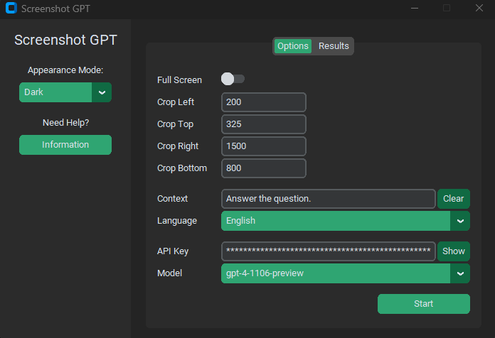
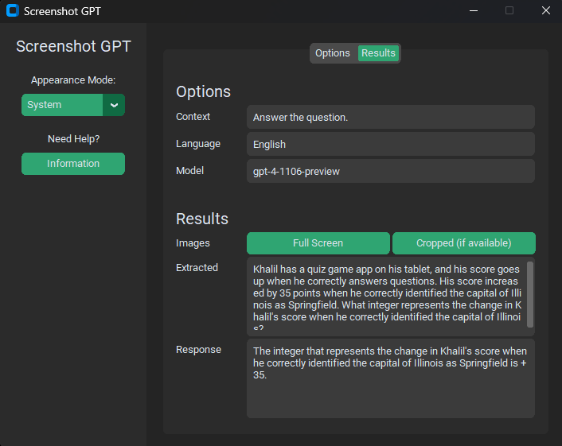

# Screenshot GPT
Screenshot GPT is an open-source Python GUI application built using the customtkinter library. It captures screenshots, extracts text, sends it to the OpenAI API, and displays the generated responses.

## Screenshots



## Features
* Choose light or dark appearance modes
* Define custom left, upper, right, and lower crop coordinates
* Provide context and language for the prompt
* Select between different GPT-4 and GPT-3.5 models
* Secretly enter your API key
* View detailed results with images, extracted texts, and responses

## Dependencies
* customtkinter
* tkinter
* tkinter.messagebox
* pyautogui
* pillow
* easyocr
* openai
  
## Installation
**1. Clone the repository**
```bash
git clone https://github.com/PouyaMT/screenshot-gpt.git
```

**2. Install the dependencies**
```bash
pip install -r requirements.txt
```

**3. Run the script**
```bash
python main.py
```
